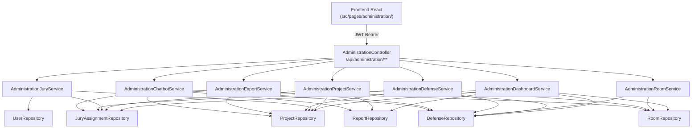
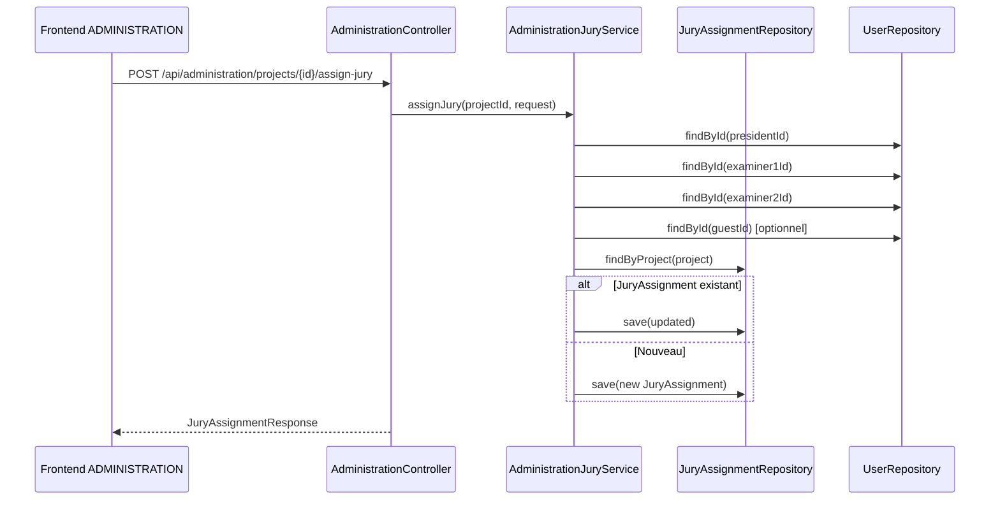
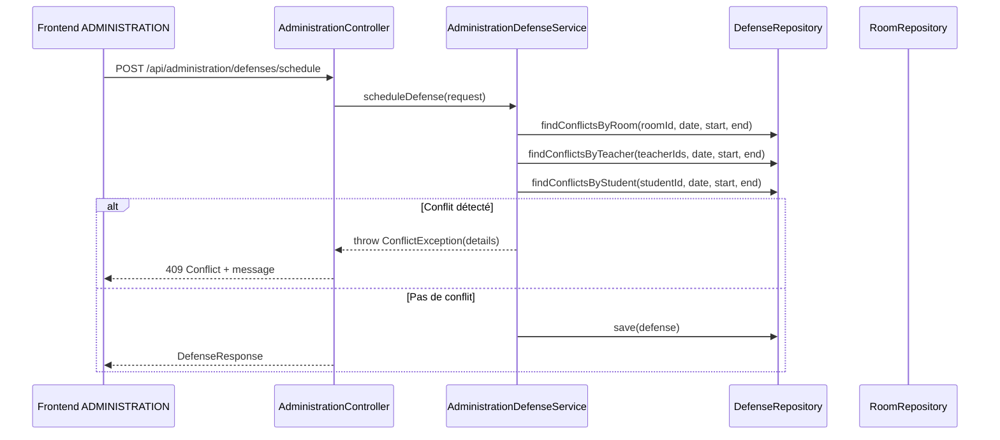
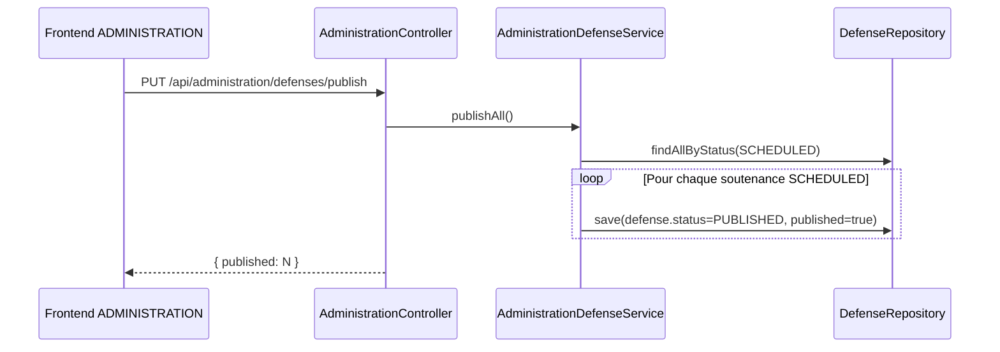

# Document de Design : administration-pedagogique

## Overview

Le module `administration-pedagogique` est le cœur opérationnel du système de gestion des soutenances PFE/Master. Il permet au rôle `ADMINISTRATION` de piloter l'ensemble du cycle de vie des soutenances : suivi des projets, affectation des jurys, gestion des salles, planification des soutenances, publication du planning et export. Un chatbot contextuel répond aux questions fréquentes sur l'état du système.

Ce module s'intègre dans le package `com.pfe.defense.administration` côté backend et dans `src/pages/administration/` côté frontend. Il réutilise les entités existantes (`Project`, `Defense`, `JuryAssignment`, `Report`, `Room`, `User`) sans les modifier, et expose ses endpoints sous `/api/administration/**` protégés par le rôle `ADMINISTRATION`.

## Architecture



## Diagrammes de séquence

### Affectation d'un jury



### Planification d'une soutenance avec détection de conflits



### Publication du planning



## Components and Interfaces

### AdministrationController

**Rôle** : Point d'entrée unique pour tous les endpoints `/api/administration/**`. Délègue à des services spécialisés. Protégé par `@PreAuthorize("hasRole('ADMINISTRATION')")`.

**Interface** :
```java
@RestController
@RequestMapping("/api/administration")
@PreAuthorize("hasRole('ADMINISTRATION')")
public class AdministrationController {
    // Dashboard
    GET  /dashboard                          → AdministrationDashboardResponse
    // Projets
    GET  /projects                           → List<AdministrationProjectResponse>
    // Jury
    POST /projects/{id}/assign-jury          → JuryAssignmentResponse
    // Salles
    GET  /rooms                              → List<RoomResponse>
    POST /rooms                              → RoomResponse
    PUT  /rooms/{id}                         → RoomResponse
    DELETE /rooms/{id}                       → 204
    // Soutenances
    GET  /defenses                           → List<DefenseResponse>
    POST /defenses/schedule                  → DefenseResponse
    PUT  /defenses/{id}                      → DefenseResponse
    PUT  /defenses/publish                   → PublishResponse
    // Export
    GET  /export/pdf                         → byte[] (application/pdf)
    GET  /export/excel                       → byte[] (xlsx)
    // Chatbot
    GET  /chatbot/suggestions                → List<String>
    POST /chatbot/ask                        → ChatbotAnswerResponse
}
```

### AdministrationDashboardService

**Rôle** : Agrège les métriques de l'ensemble du système pour le dashboard.

**Responsabilités** :
- Compter les projets déposés (status != DRAFT)
- Identifier les projets sans jury (pas de JuryAssignment)
- Identifier les soutenances non planifiées (Defense.status = NOT_SCHEDULED ou absence de Defense)
- Compter les salles disponibles (Room.available = true)
- Détecter les conflits de planning (même salle/enseignant/étudiant au même créneau)
- Compter les rapports visibles (Report.visibleToJury = true)
- Compter les rapports non visibles (Report.visibleToJury = false et status != NOT_SUBMITTED)

### AdministrationProjectService

**Rôle** : Fournit la vue consolidée de tous les projets avec leurs statuts croisés.

**Responsabilités** :
- Lister tous les projets avec : étudiant, titre, encadrant, filière (academicYear), statut rapport, statut jury (présence JuryAssignment), statut planning (Defense.status)

### AdministrationJuryService

**Rôle** : Gère l'affectation des membres du jury à un projet.

**Responsabilités** :
- Valider que president, examiner1, examiner2 existent et ont le rôle JURY ou SUPERVISOR
- Créer ou mettre à jour le JuryAssignment
- Ne jamais modifier la visibilité du rapport (règle métier stricte)

### AdministrationRoomService

**Rôle** : CRUD complet sur les salles.

**Responsabilités** :
- Créer, lire, modifier, supprimer des salles
- Empêcher la suppression d'une salle utilisée dans une soutenance planifiée

### AdministrationDefenseService

**Rôle** : Planification des soutenances avec détection de conflits.

**Responsabilités** :
- Créer un brouillon de soutenance (status = SCHEDULED)
- Modifier une soutenance existante
- Détecter les 3 types de conflits avant toute sauvegarde
- Publier toutes les soutenances SCHEDULED → PUBLISHED
- Fournir la liste complète des soutenances

### AdministrationExportService

**Rôle** : Génération des exports PDF et Excel du planning.

**Responsabilités** :
- Exporter le planning des soutenances publiées en PDF (iText/OpenPDF)
- Exporter le planning en Excel (Apache POI)

### AdministrationChatbotService

**Rôle** : Chatbot simple basé sur la correspondance de mots-clés normalisés.

**Responsabilités** :
- Répondre aux 4 questions prédéfinies sur l'état du système
- Fournir la liste des suggestions

## Data Models

### AdministrationDashboardResponse

```java
public record AdministrationDashboardResponse(
    long totalProjectsSubmitted,    // projets avec status != DRAFT
    long projectsWithoutJury,       // projets sans JuryAssignment
    long defensesNotScheduled,      // projets sans Defense ou Defense.status=NOT_SCHEDULED
    long availableRooms,            // Room.available = true
    int  conflictsDetected,         // nombre de conflits détectés dans le planning
    long reportsVisible,            // Report.visibleToJury = true
    long reportsNotVisible          // rapports soumis mais pas encore visibles
) {}
```

### AdministrationProjectResponse

```java
public record AdministrationProjectResponse(
    Long   projectId,
    String title,
    String studentName,             // firstName + lastName
    String supervisorName,
    String academicYear,
    String projectType,             // PFE / MASTER
    String projectStatus,           // DRAFT/SUBMITTED/VALIDATED/REJECTED
    String reportStatus,            // NOT_SUBMITTED/.../VISIBLE_TO_JURY
    boolean reportVisibleToJury,
    boolean juryAssigned,           // JuryAssignment présent
    String defenseStatus            // NOT_SCHEDULED/SCHEDULED/PUBLISHED/COMPLETED
) {}
```

### JuryAssignRequest

```java
public record JuryAssignRequest(
    @NotNull Long presidentId,
    @NotNull Long examiner1Id,
    @NotNull Long examiner2Id,
             Long guestId           // optionnel
) {}
```

### JuryAssignmentResponse

```java
public record JuryAssignmentResponse(
    Long          id,
    Long          projectId,
    String        projectTitle,
    UserSummary   president,
    UserSummary   examiner1,
    UserSummary   examiner2,
    UserSummary   guest,            // null si absent
    LocalDateTime assignedAt
) {}

public record UserSummary(Long id, String firstName, String lastName, String email, String role) {}
```

### RoomRequest / RoomResponse

```java
public record RoomRequest(
    @NotBlank String  name,
    @NotBlank String  building,
    @Min(1)   Integer capacity,
              String  equipment,
              boolean available
) {}

public record RoomResponse(
    Long    id,
    String  name,
    String  building,
    Integer capacity,
    String  equipment,
    boolean available
) {}
```

### ScheduleDefenseRequest / DefenseResponse

```java
public record ScheduleDefenseRequest(
    @NotNull Long      projectId,
    @NotNull LocalDate defenseDate,
    @NotNull LocalTime startTime,
    @NotNull LocalTime endTime,
    @NotNull Long      roomId
) {}

public record DefenseResponse(
    Long         id,
    Long         projectId,
    String       projectTitle,
    String       studentName,
    LocalDate    defenseDate,
    LocalTime    startTime,
    LocalTime    endTime,
    RoomResponse room,
    String       status,
    boolean      published
) {}
```

### PublishResponse

```java
public record PublishResponse(int published) {}
```

### ChatbotAskRequest / ChatbotAnswerResponse

```java
public record ChatbotAskRequest(@NotBlank String question) {}
public record ChatbotAnswerResponse(String question, String answer) {}
```

## Pseudocode algorithmique

### Algorithme de détection de conflits

```pascal
ALGORITHM detectConflicts(projectId, defenseDate, startTime, endTime, roomId)
INPUT:  projectId, defenseDate, startTime, endTime, roomId
OUTPUT: List<ConflictDetail>

BEGIN
  conflicts ← []
  project   ← projectRepository.findById(projectId)
  jury      ← juryAssignmentRepository.findByProject(project)

  // Conflit 1 : même salle au même créneau
  roomConflicts ← defenseRepository.findByRoomAndDateAndTimeOverlap(
                    roomId, defenseDate, startTime, endTime, excludeProjectId=projectId)
  FOR each conflict IN roomConflicts DO
    conflicts.add(ConflictDetail("ROOM", conflict.project.title, conflict.startTime, conflict.endTime))
  END FOR

  // Conflit 2 : même enseignant dans deux soutenances simultanées
  IF jury IS NOT NULL THEN
    teacherIds ← [jury.president.id, jury.examiner1.id, jury.examiner2.id]
    IF jury.guest IS NOT NULL THEN teacherIds.add(jury.guest.id) END IF

    FOR each teacherId IN teacherIds DO
      teacherConflicts ← defenseRepository.findByJuryMemberAndDateAndTimeOverlap(
                           teacherId, defenseDate, startTime, endTime, excludeProjectId=projectId)
      FOR each conflict IN teacherConflicts DO
        conflicts.add(ConflictDetail("TEACHER", conflict.project.title, conflict.startTime, conflict.endTime))
      END FOR
    END FOR
  END IF

  // Conflit 3 : même étudiant dans deux soutenances
  studentConflicts ← defenseRepository.findByStudentAndDateAndTimeOverlap(
                       project.student.id, defenseDate, startTime, endTime, excludeProjectId=projectId)
  FOR each conflict IN studentConflicts DO
    conflicts.add(ConflictDetail("STUDENT", conflict.project.title, conflict.startTime, conflict.endTime))
  END FOR

  RETURN conflicts
END
```

**Préconditions :**
- `projectId` référence un projet existant
- `defenseDate`, `startTime`, `endTime` sont non nuls et `startTime < endTime`
- `roomId` référence une salle existante

**Postconditions :**
- Retourne une liste vide si aucun conflit
- Chaque conflit identifie son type (ROOM, TEACHER, STUDENT) et le projet en conflit

**Invariant de boucle :**
- Tous les conflits déjà ajoutés à `conflicts` sont valides et distincts

---

### Algorithme de planification d'une soutenance

```pascal
ALGORITHM scheduleDefense(request)
INPUT:  ScheduleDefenseRequest
OUTPUT: DefenseResponse

BEGIN
  project ← projectRepository.findById(request.projectId)
            OR THROW ResourceNotFoundException

  room    ← roomRepository.findById(request.roomId)
            OR THROW ResourceNotFoundException

  conflicts ← detectConflicts(request.projectId, request.defenseDate,
                               request.startTime, request.endTime, request.roomId)

  IF conflicts IS NOT EMPTY THEN
    THROW ConflictException(conflicts)
  END IF

  defense ← defenseRepository.findByProject(project)
             OR NEW Defense()

  defense.project     ← project
  defense.room        ← room
  defense.defenseDate ← request.defenseDate
  defense.startTime   ← request.startTime
  defense.endTime     ← request.endTime
  defense.status      ← SCHEDULED

  saved ← defenseRepository.save(defense)
  RETURN toDefenseResponse(saved)
END
```

---

### Algorithme d'affectation du jury

```pascal
ALGORITHM assignJury(projectId, request)
INPUT:  projectId: Long, request: JuryAssignRequest
OUTPUT: JuryAssignmentResponse

BEGIN
  project   ← projectRepository.findById(projectId) OR THROW ResourceNotFoundException
  president ← userRepository.findById(request.presidentId) OR THROW ResourceNotFoundException
  examiner1 ← userRepository.findById(request.examiner1Id) OR THROW ResourceNotFoundException
  examiner2 ← userRepository.findById(request.examiner2Id) OR THROW ResourceNotFoundException

  // Validation des rôles
  FOR each member IN [president, examiner1, examiner2] DO
    IF member.role NOT IN [JURY, SUPERVISOR] THEN
      THROW BadRequestException("L'utilisateur " + member.email + " n'a pas le rôle requis")
    END IF
  END FOR

  guest ← NULL
  IF request.guestId IS NOT NULL THEN
    guest ← userRepository.findById(request.guestId) OR THROW ResourceNotFoundException
  END IF

  assignment ← juryAssignmentRepository.findByProject(project)
               OR NEW JuryAssignment()

  assignment.project   ← project
  assignment.president ← president
  assignment.examiner1 ← examiner1
  assignment.examiner2 ← examiner2
  assignment.guest     ← guest
  assignment.assignedAt ← LocalDateTime.now()

  // RÈGLE CRITIQUE : ne jamais modifier Report.visibleToJury ici
  // La visibilité du rapport reste sous contrôle exclusif de l'encadrant

  saved ← juryAssignmentRepository.save(assignment)
  RETURN toJuryAssignmentResponse(saved)
END
```

**Préconditions :**
- `presidentId`, `examiner1Id`, `examiner2Id` sont non nuls
- Les utilisateurs référencés existent
- `guestId` peut être null

**Postconditions :**
- Un JuryAssignment est créé ou mis à jour pour le projet
- `Report.visibleToJury` n'est PAS modifié

---

### Algorithme de publication du planning

```pascal
ALGORITHM publishAll()
INPUT:  (aucun)
OUTPUT: PublishResponse

BEGIN
  defenses ← defenseRepository.findAllByStatus(SCHEDULED)
  count    ← 0

  FOR each defense IN defenses DO
    defense.status    ← PUBLISHED
    defense.published ← true
    defenseRepository.save(defense)
    count ← count + 1
  END FOR

  RETURN PublishResponse(count)
END
```

---

### Algorithme du chatbot administration

```pascal
ALGORITHM ask(question)
INPUT:  question: String
OUTPUT: ChatbotAnswerResponse

BEGIN
  normalized ← normalize(question)  // minuscules, sans accents

  IF normalized CONTAINS "jury" AND (normalized CONTAINS "pas" OR normalized CONTAINS "sans") THEN
    projects ← projectRepository.findAllWithoutJury()
    IF projects IS EMPTY THEN
      answer ← "Tous les projets ont un jury affecté."
    ELSE
      answer ← projects.size() + " projet(s) sans jury : " + join(projects.titles)
    END IF

  ELSE IF normalized CONTAINS "rapport" AND (normalized CONTAINS "visible" OR normalized CONTAINS "pas visible") THEN
    reports ← reportRepository.findAllNotVisibleToJury()
    IF reports IS EMPTY THEN
      answer ← "Tous les rapports soumis sont visibles au jury."
    ELSE
      answer ← reports.size() + " rapport(s) non visible(s) au jury."
    END IF

  ELSE IF normalized CONTAINS "conflit" THEN
    conflicts ← detectAllConflicts()
    IF conflicts IS EMPTY THEN
      answer ← "Aucun conflit de planning détecté."
    ELSE
      answer ← conflicts.size() + " conflit(s) détecté(s) dans le planning."
    END IF

  ELSE IF normalized CONTAINS "salle" AND normalized CONTAINS "disponible" THEN
    rooms ← roomRepository.findAllByAvailableTrue()
    answer ← rooms.size() + " salle(s) disponible(s) : " + join(rooms.names)

  ELSE
    answer ← "Je peux répondre sur : les projets sans jury, les rapports non visibles, les conflits de planning, les salles disponibles."
  END IF

  RETURN ChatbotAnswerResponse(question, answer)
END
```

## Fonctions clés avec spécifications formelles

### `detectConflicts(projectId, defenseDate, startTime, endTime, roomId)`

**Préconditions :**
- `projectId` ∈ projets existants
- `startTime < endTime`
- `roomId` ∈ salles existantes

**Postconditions :**
- ∀ conflit c ∈ résultat : c.type ∈ {ROOM, TEACHER, STUDENT}
- Si résultat = [] alors aucun chevauchement temporel n'existe pour la salle, les enseignants et l'étudiant
- La fonction ne modifie aucune entité en base

**Invariant de boucle :** Tous les conflits déjà collectés sont valides avant chaque itération

---

### `assignJury(projectId, request)`

**Préconditions :**
- `request.presidentId`, `request.examiner1Id`, `request.examiner2Id` ≠ null
- Les 3 utilisateurs obligatoires ont le rôle JURY ou SUPERVISOR
- `projectId` référence un projet existant

**Postconditions :**
- Un JuryAssignment existe pour le projet après l'appel
- `Report.visibleToJury` reste inchangé (invariant de sécurité métier)
- `JuryAssignment.assignedAt` = heure de l'appel

---

### `scheduleDefense(request)`

**Préconditions :**
- `request.projectId` et `request.roomId` référencent des entités existantes
- `request.startTime < request.endTime`
- `detectConflicts(...)` retourne une liste vide

**Postconditions :**
- Une Defense existe pour le projet avec `status = SCHEDULED`
- La salle est associée à la soutenance
- Aucun conflit de type ROOM, TEACHER ou STUDENT n'existe pour ce créneau

---

### `publishAll()`

**Préconditions :** Au moins une Defense avec `status = SCHEDULED` existe (sinon retourne 0)

**Postconditions :**
- ∀ defense d qui avait `status = SCHEDULED` : d.status = PUBLISHED ∧ d.published = true
- Aucune Defense avec `status ≠ SCHEDULED` n'est modifiée

---

### `deleteRoom(id)`

**Préconditions :** La salle existe

**Postconditions :**
- Si la salle est utilisée dans une Defense planifiée → `BadRequestException` levée, salle non supprimée
- Sinon → salle supprimée de la base

## Exemple d'utilisation (flux complet)

```java
// 1. Consulter le dashboard
GET /api/administration/dashboard
// → { totalProjectsSubmitted: 12, projectsWithoutJury: 3, defensesNotScheduled: 5, ... }

// 2. Lister les projets
GET /api/administration/projects
// → [{ projectId: 1, title: "IA pour la santé", studentName: "Alice Martin",
//      juryAssigned: false, defenseStatus: "NOT_SCHEDULED", ... }]

// 3. Affecter un jury au projet 1
POST /api/administration/projects/1/assign-jury
{ "presidentId": 10, "examiner1Id": 11, "examiner2Id": 12 }
// → { id: 1, projectId: 1, president: { id: 10, ... }, ... }

// 4. Créer une salle
POST /api/administration/rooms
{ "name": "Salle A101", "building": "Bâtiment A", "capacity": 30, "available": true }
// → { id: 5, name: "Salle A101", ... }

// 5. Planifier la soutenance
POST /api/administration/defenses/schedule
{ "projectId": 1, "defenseDate": "2025-06-15", "startTime": "09:00", "endTime": "10:00", "roomId": 5 }
// → { id: 1, projectId: 1, defenseDate: "2025-06-15", status: "SCHEDULED", ... }

// 6. Publier le planning
PUT /api/administration/defenses/publish
// → { published: 8 }

// 7. Exporter en PDF
GET /api/administration/export/pdf
// → fichier planning-soutenances.pdf

// 8. Chatbot
POST /api/administration/chatbot/ask
{ "question": "Quels projets n'ont pas encore de jury ?" }
// → { question: "...", answer: "3 projet(s) sans jury : IA pour la santé, ..." }
```

## Correctness Properties

### Property 1: Isolation de la visibilité rapport
∀ appel à `assignJury(...)`, `Report.visibleToJury` reste inchangé. Seul l'encadrant peut activer cette propriété via son propre module.

### Property 2: Unicité de la soutenance par projet
∀ projet p, il existe au plus une Defense associée (contrainte `@OneToOne unique=true` en base).

### Property 3: Absence de conflit après planification
Si `scheduleDefense(r)` réussit, alors aucune autre Defense ne partage la même salle, le même enseignant ou le même étudiant sur le même créneau.

### Property 4: Monotonie de la publication
`publishAll()` ne rétrograde jamais une Defense de PUBLISHED vers SCHEDULED.

### Property 5: Intégrité référentielle des jurys
Tout membre de jury référencé dans un JuryAssignment a le rôle JURY ou SUPERVISOR.

### Property 6: Sécurité des endpoints
∀ requête sur `/api/administration/**` sans token JWT valide avec rôle ADMINISTRATION → réponse 403.

## Error Handling

### Conflit de planning (409 Conflict)
**Condition** : `detectConflicts(...)` retourne une liste non vide lors de `scheduleDefense`
**Réponse** : HTTP 409 avec corps `{ "message": "Conflit détecté", "conflicts": [...] }`
**Récupération** : L'administration choisit un autre créneau ou une autre salle

### Ressource introuvable (404 Not Found)
**Condition** : `projectId`, `roomId`, `userId` inexistant
**Réponse** : HTTP 404 via `ResourceNotFoundException` → `GlobalExceptionHandler`
**Récupération** : Vérifier l'identifiant fourni

### Rôle invalide pour jury (400 Bad Request)
**Condition** : Un utilisateur affecté comme membre de jury n'a pas le rôle JURY ou SUPERVISOR
**Réponse** : HTTP 400 via `BadRequestException`
**Récupération** : Sélectionner un utilisateur avec le bon rôle

### Suppression de salle utilisée (400 Bad Request)
**Condition** : Tentative de suppression d'une salle référencée dans une Defense planifiée
**Réponse** : HTTP 400 avec message explicatif
**Récupération** : Déprogrammer ou réaffecter la soutenance avant suppression

### Accès non autorisé (403 Forbidden)
**Condition** : Token JWT absent, expiré, ou rôle ≠ ADMINISTRATION
**Réponse** : HTTP 403 géré par `SecurityConfig` + `JwtAuthenticationFilter`
**Récupération** : Se reconnecter avec un compte ADMINISTRATION

## Testing Strategy

### Tests unitaires

- `AdministrationJuryService` : vérifier que `Report.visibleToJury` n'est jamais modifié lors de `assignJury`
- `AdministrationDefenseService` : vérifier que `scheduleDefense` lève une exception si `detectConflicts` retourne des conflits
- `AdministrationDefenseService` : vérifier que `publishAll` ne modifie que les soutenances SCHEDULED
- `AdministrationRoomService` : vérifier que `deleteRoom` échoue si la salle est utilisée
- `AdministrationChatbotService` : vérifier les 4 questions supportées et la réponse par défaut

### Tests basés sur les propriétés (Property-Based Testing)

**Bibliothèque** : JUnit 5 + jqwik (Java)

- **Propriété 1** : Pour tout ensemble de soutenances planifiées sans conflit, `detectConflicts` retourne toujours une liste vide
- **Propriété 2** : Pour tout créneau chevauchant une soutenance existante dans la même salle, `detectConflicts` retourne au moins un conflit ROOM
- **Propriété 3** : `publishAll()` est idempotent — appeler deux fois ne change pas le résultat

### Tests d'intégration

- Flux complet : créer projet → affecter jury → créer salle → planifier soutenance → publier → exporter
- Vérifier que les endpoints retournent 403 pour un token avec rôle STUDENT
- Vérifier la détection de conflit de salle avec deux soutenances chevauchantes

## Considérations de performance

- Les requêtes de détection de conflits utilisent des index sur `(defense_date, start_time, end_time, room_id)` et sur les clés étrangères des membres du jury
- Le dashboard agrège des comptages simples (`COUNT`) sans chargement d'entités complètes
- Les exports PDF/Excel sont générés à la demande et streamés directement sans stockage intermédiaire

## Considérations de sécurité

- Tous les endpoints sont protégés par `@PreAuthorize("hasRole('ADMINISTRATION')")` en plus de la règle globale `anyRequest().authenticated()` dans `SecurityConfig`
- L'administration ne peut jamais appeler d'endpoint modifiant `Report.visibleToJury` — cette propriété est gérée exclusivement dans le module `supervisor`
- Les exports ne contiennent pas de données sensibles (mots de passe, tokens)
- Les identifiants dans les URLs sont validés côté service avant tout accès en base

## Dépendances

**Backend :**
- Spring Boot 3 / Spring Security (existant)
- Spring Data JPA (existant)
- Jakarta Validation (existant)
- iText / OpenPDF (export PDF) — à ajouter dans `pom.xml` si absent
- Apache POI (export Excel) — à ajouter dans `pom.xml` si absent

**Frontend :**
- React 18 (existant)
- Tailwind CSS (existant)
- Axios via `src/services/api.js` (existant)
- `src/context/AuthContext.jsx` (existant)

## Architecture Frontend

### Pages à créer dans `src/pages/administration/`

| Fichier | Route | Description |
|---|---|---|
| `AdministrationDashboard.jsx` | `/administration/dashboard` | Remplace le placeholder, affiche les 7 métriques |
| `ProjectManagement.jsx` | `/administration/projects` | Tableau de tous les projets avec statuts croisés |
| `JuryAssignment.jsx` | `/administration/jury` | Formulaire d'affectation jury par projet |
| `RoomManagement.jsx` | `/administration/rooms` | CRUD salles avec modal |
| `DefensePlanning.jsx` | `/administration/defenses` | Calendrier/tableau de planification avec détection conflits |
| `PlanningExport.jsx` | `/administration/export` | Boutons publication + export PDF/Excel |
| `AdministrationChatbot.jsx` | `/administration/chatbot` | Interface chatbot avec suggestions cliquables |

### Composants à créer dans `src/components/administration/`

| Composant | Rôle |
|---|---|
| `ConflictAlert.jsx` | Affiche les conflits détectés lors de la planification |
| `JuryAssignForm.jsx` | Formulaire de sélection des membres du jury |
| `RoomForm.jsx` | Formulaire création/édition salle (modal) |
| `DefenseForm.jsx` | Formulaire planification soutenance |
| `ProjectStatusBadge.jsx` | Badge coloré pour les différents statuts |

### Navigation (mise à jour de `Layout.jsx`)

Le composant `Layout.jsx` doit être étendu pour inclure les liens de navigation du rôle `ADMINISTRATION` :

```javascript
const administrationLinks = [
  { to: '/administration/dashboard', label: 'Dashboard' },
  { to: '/administration/projects', label: 'Projets' },
  { to: '/administration/jury', label: 'Affectation jury' },
  { to: '/administration/rooms', label: 'Salles' },
  { to: '/administration/defenses', label: 'Planning soutenances' },
  { to: '/administration/export', label: 'Publication & Export' },
  { to: '/administration/chatbot', label: 'Chatbot' },
]
```

### Routes à ajouter dans `App.jsx`

```jsx
<Route element={<ProtectedRoute allowedRoles={['ADMINISTRATION']} />}>
  <Route element={<Layout />}>
    <Route path="/administration/dashboard" element={<AdministrationDashboard />} />
    <Route path="/administration/projects" element={<ProjectManagement />} />
    <Route path="/administration/jury" element={<JuryAssignment />} />
    <Route path="/administration/rooms" element={<RoomManagement />} />
    <Route path="/administration/defenses" element={<DefensePlanning />} />
    <Route path="/administration/export" element={<PlanningExport />} />
    <Route path="/administration/chatbot" element={<AdministrationChatbot />} />
  </Route>
</Route>
```
